# LED Cube

[](https://github.com/elliotmatson/LED_Cube/actions/workflows/build-release.yml)

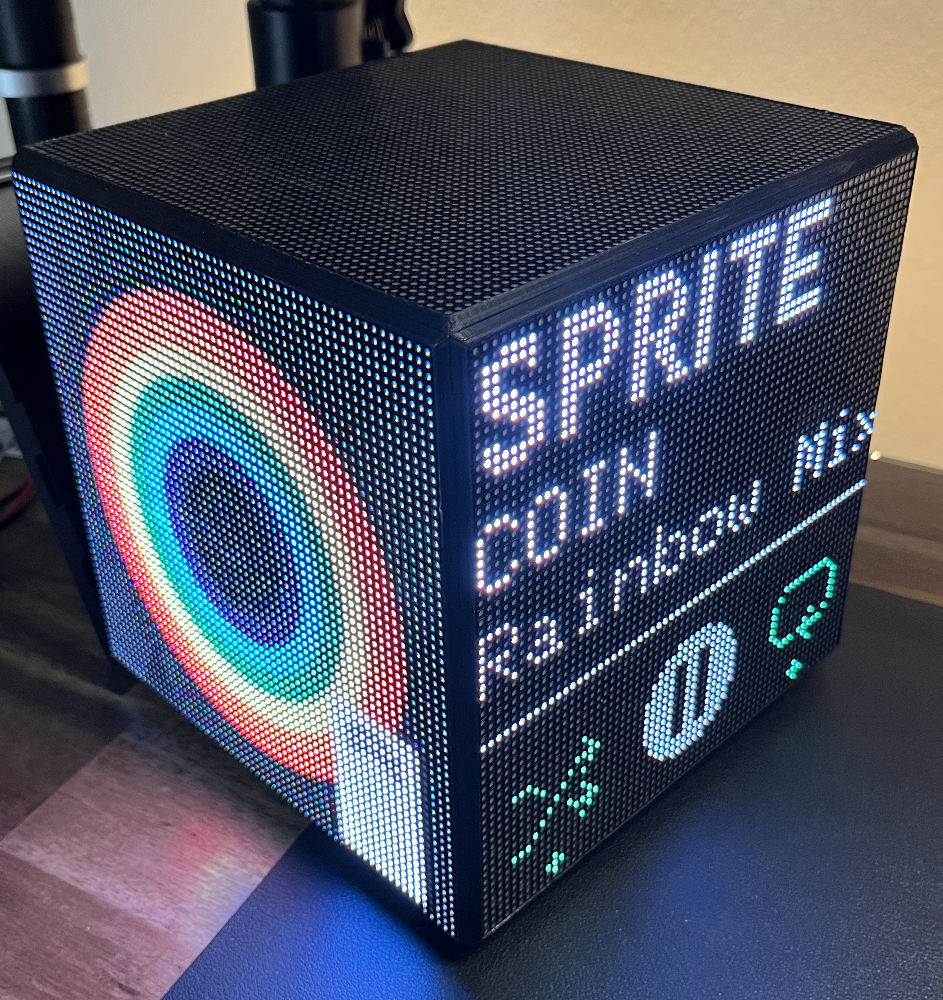

An ESP32 based LED cube, inspired by [this project](https://github.com/Staacks/there.oughta.be/tree/master/led-cube).

## Patterns

Recorded from a running cube with `scripts/capture_patterns.py` and drawn as the cube looks from its corner.

<table>
<tr><td align="center" width="33%">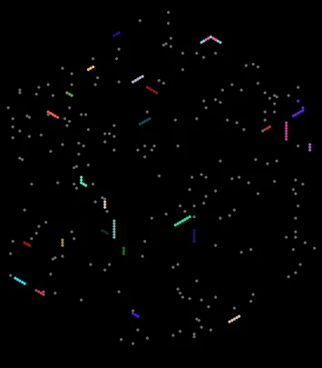<br><b>Snake</b><br><sub>Snakes of many kinds roam all three faces, crossing the seams, eating and growing.</sub></td><td align="center" width="33%">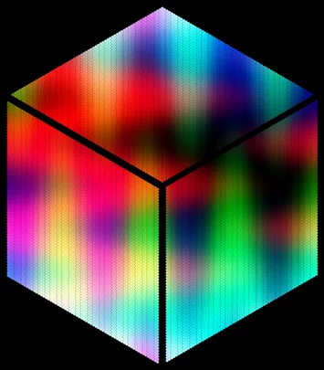<br><b>Plasma</b><br><sub>A classic plasma, projected so it flows continuously across the corner.</sub></td><td align="center" width="33%">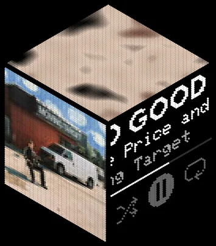<br><b>Spotify</b><br><sub>Album art, scrolling track details and playback state, with the album's colours on top. See <a href="#spotify">Spotify</a>.</sub></td></tr>
<tr><td align="center" width="33%">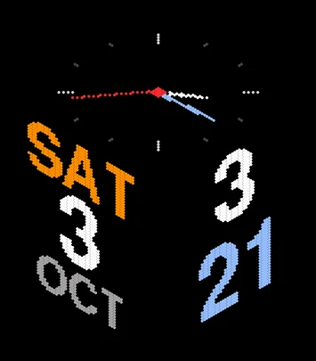<br><b>Clock</b><br><sub>An analog dial on top, the time on the right, the date on the left.</sub></td><td align="center" width="33%">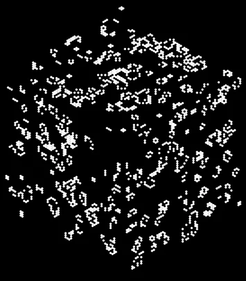<br><b>Game of Life</b><br><sub>Conway's Life on all three faces as one surface; gliders cross the seams.</sub></td><td align="center" width="33%">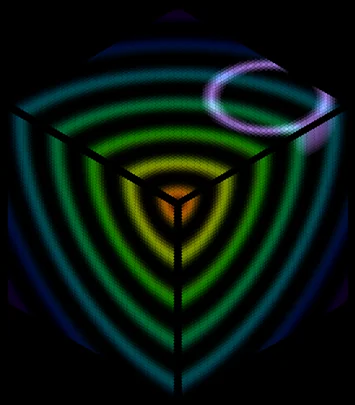<br><b>Ripples</b><br><sub>Rings spreading from the corner, plus raindrops.</sub></td></tr>
<tr><td align="center" width="33%">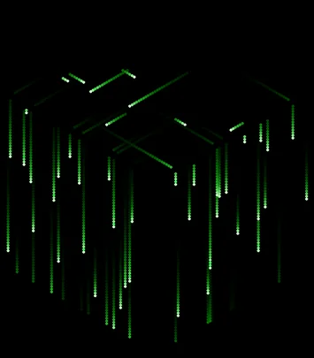<br><b>Matrix Rain</b><br><sub>Rain across the top, over the edges and down the sides.</sub></td><td align="center" width="33%">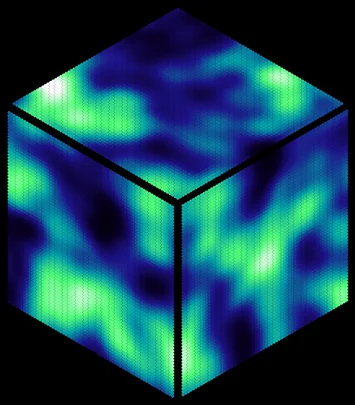<br><b>Nebula</b><br><sub>A drifting 3D noise cloud the cube is cut out of.</sub></td><td align="center" width="33%">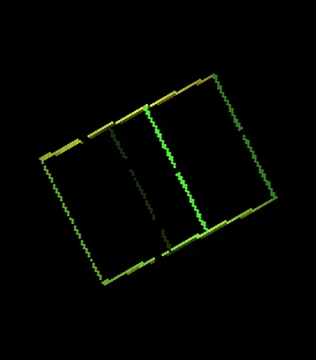<br><b>Wireframes</b><br><sub>Rotating solids floating inside the cube.</sub></td></tr>
<tr><td align="center" width="33%">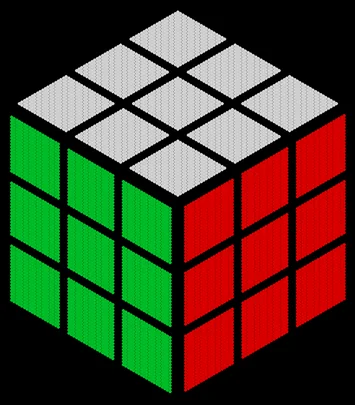<br><b>Rubik's Cube</b><br><sub>Scrambles, then solves itself.</sub></td><td align="center" width="33%">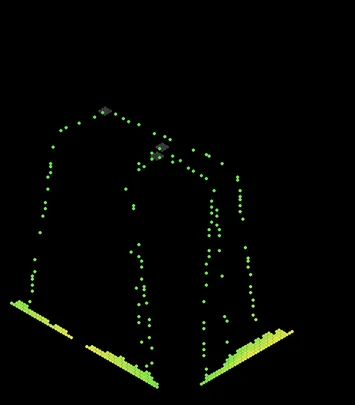<br><b>Falling Sand</b><br><sub>Sand poured from the top piles up down the sides.</sub></td><td align="center" width="33%">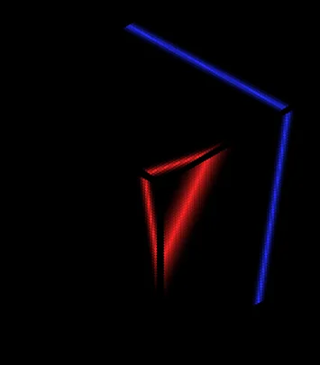<br><b>Plane Sweep</b><br><sub>Coloured planes sweeping through the cube's volume.</sub></td></tr>
<tr><td align="center" width="33%">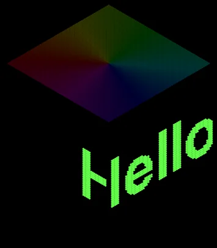<br><b>Ticker</b><br><sub>Your message, the time and the date scrolling around the sides.</sub></td></tr>
</table>

## Table of Contents
- [LED Cube](#led-cube)
  - [Patterns](#patterns)
  - [Table of Contents](#table-of-contents)
  - [Development](#development)
    - [Setting up Dev Environment](#setting-up-dev-environment)
    - [Building](#building)
    - [Uploading](#uploading)
  - [Spotify](#spotify)

## Development

### Setting up Dev Environment
To build firmware for this cube, all you need is an IDE and PlatformIO. I use VSCode, but you can use whatever you want. See [here](https://docs.platformio.org/en/latest/integration/ide/vscode.html#quick-start) for more details on setting up PlatformIO in VSCode.

Clone this repo, and open it in your IDE. You should be able to move on to building.

### Building
This project uses ESPIDF with Arduino as a component, and PlatformIO to build and upload firmware. To build, just click the build button in your IDE. To upload, click the upload button. You can also use the PlatformIO CLI to build and upload. See [here](https://docs.platformio.org/en/latest/core/userguide/cmd_build.html) for more details.

### Uploading
Currently, the cubes support 4 different methods of getting new firmware. The first one, used exclusively in production, is downloading straight from Github releases. These builds are created with Github Actions and are not used for development; a cube running a local `DEV` build never replaces itself this way. The second is the **Update Firmware** card on the dashboard's System tab: upload `esp32-s3-devkitc-1-<version>.bin` from a release, or `.pio/build/esp32-s3-devkitc-1/firmware.bin` from a local build. The cube checks the image before writing it. The third method is using OTA updates (switch on "OTA Update Enabled" on the dashboard first). This is the easiest method of uploading new firmware during development. To upload using OTA, you need to have the cube connected to your network. Ensure that these two lines are uncommented in platformio.ini, and that the cube is on the same network as your computer:

```ini
upload_protocol = espota
upload_port = cube.local
```

Then, click the upload button in your IDE. This will upload the firmware to the cube over the network. The cube will then reboot and start running the new firmware. 

The fourth method is using a USB to serial adapter. This is mostly only useful if you have uploaded firmware that breaks OTA, bur can also be used for debugging. To upload using serial, you need to have the cube connected to your computer via USB. 


Connect the Cube GND to the adaptor GND, the Cube TX to the adaptor RX, and the Cube RX to the adaptor TX, then comment out these two lines in platformio.ini:

```ini
;upload_protocol = espota
;upload_port = cube.local
```
    
Then, click the upload button in your IDE. This will upload the firmware to the cube over serial. The cube will then reboot and start running the new firmware.

## Spotify

The Spotify pattern shows what is playing on your account: album art on one side face, the track, artist, a progress bar and playback state on the other. Each cube uses your own Spotify app, because Spotify's developer mode limits an app to its owner and a few allowlisted users.

1. Sign in at [developer.spotify.com/dashboard](https://developer.spotify.com/dashboard) and create an app (any name). Development mode needs the app owner to have Spotify Premium.
2. Under **Redirect URIs**, add exactly:
   `https://elliotmatson.github.io/LED_Cube/spotify/callback.html`
   (Spotify only accepts HTTPS redirects, which the cube cannot serve itself; this page just forwards the login back to your cube on your network.)
3. Select **Web API**, save, then copy the app's **Client ID** and **Client Secret**.
4. On the cube's dashboard, open the **Spotify** tab and paste them into **Spotify Client ID** and **Spotify Client Secret**.
5. Use **Log in to Spotify** on that tab (or open `http://cube.local/spotify`), and approve the app. The browser comes back to the cube, which finishes the login and switches to the Spotify pattern.

If something goes wrong, the Spotify card on that tab says what (also at `/api/v1/spotify`). **Log out of Spotify** forgets the linked account. To use another account in development mode, add its email under the app's **User Management** first.

For local builds you can instead put `SPOTIFY_CLIENT_ID` and `SPOTIFY_CLIENT_SECRET` in `lib/cube/secrets.h` (gitignored); they are used only when the dashboard fields are empty. Never put the secret in a build you publish.

## Recording the pattern animations

The animations above come from the cube itself: `GET /api/v1/frame` returns the frame it is showing, and the script switches through every pattern and records each one.

```bash
uv run --with pillow scripts/capture_patterns.py --host cube.local
```

Pass pattern ids to record only some of them, e.g. `... --host cube.local clock nebula`.
